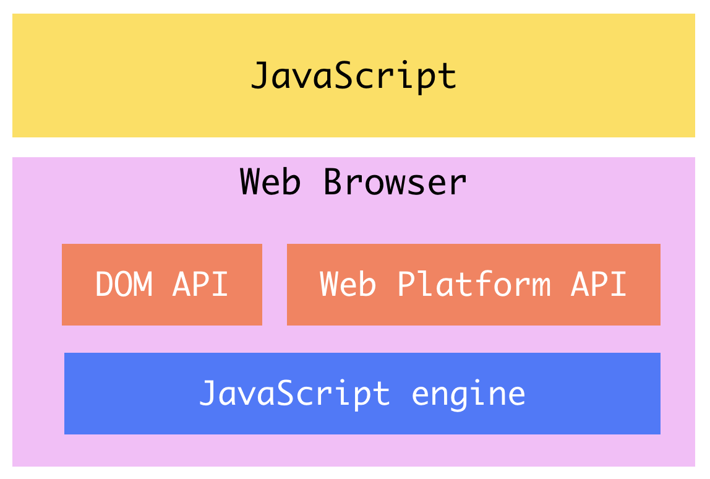
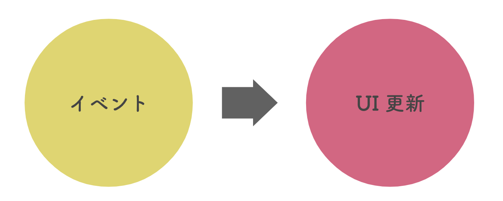

# JavaScript 超概論

フロントエンド、つまりブラウザの中で動く JavaScript について、キーワードをピックアップして簡単に説明する。

## ブラウザの中のJavaScript

Web ブラウザには、JavaScript を解析して実行するための処理系が内蔵されている。



この処理系は、二段構造になっている。JavaScript エンジンとブラウザ固有の API だ。

JavaScript エンジンは、制御構文やデータ構造など、基礎となる文法を解析するためのもの。

しかし、Web ブラウザにただ汎用的なプログラミング言語が埋まっていても意味はない。コア機能の上に、ブラウザに指令を送る機能（[API](https://developer.mozilla.org/ja/docs/Web/API)）が搭載されている。これにより、JavaScript を用いて **Web ページの見た目を更新**したり、さらには[ページ上にグラフィックを描いたり](https://developer.mozilla.org/ja/docs/Web/API/Canvas_API)、[ブラウザ内にデータを保存したり](https://developer.mozilla.org/ja/docs/Web/API/Storage_API)、[プッシュ通知を受信したり](https://developer.mozilla.org/ja/docs/Web/API/Push_API)することができる。

## DOM（Document Object Model）

JavaScript は、どのようにして Web ページの見た目を操るのか？

Web ブラウザは、Web サーバから受け取った HTML 文書を解析し、**DOM**（Document Object Model）と呼ばれるデータ構造に変換する。HTML が持つ要素の親子関係を、ツリー構造で表現するため、変換結果は DOM ツリーと呼ばれる。

DOM ツリーに CSS を解析して得られたスタイルルールを紐づけてレイアウト（画面上の配置）が計算され、最終的に描画（レンダリング）される。

つまり、DOM ツリー（もしくは単に DOM とも呼ばれる）は Web ブラウザがページを描画するための計算処理の起点となるデータである。

::: tip 参考
- [フロントエンジニアなら知っておきたいブラウザレンダリングの仕組みをわかりやすく解説！ | LeapIn](https://leap-in.com/ja/lets-learn-how-to-browser-works/)
- [ブラウザのしくみ: 最新ウェブブラウザの内部構造 - HTML5 Rocks](https://www.html5rocks.com/ja/tutorials/internals/howbrowserswork/)
:::

ブラウザには、JavaScript から DOM を操作するための機能群（DOM API）が内蔵されている。JavaScript からブラウザ内に構築された DOM を操作することで、描画の再計算を促し、ページの見た目が更新される。

DOM API には、要素の検索や生成、挿入など、DOM を扱うための様々な機能が揃っている。

```js
// 要素の取得
const box = document.querySelector('#box-1');
// 要素の生成
const child = document.createElement('p');
// テキストの挿入
child.insertAdjacentText('beforeend', 'Hello world!');
// 要素の挿入
box.appendChild(child);
```

HTML がブラウザ内で DOM に変換され、JavaScript が DOM を操作する。この仕組みによって、動きのある Web ページが表現される。

## イベント駆動

フロントエンド JavaScript はイベント駆動のプログラミングモデルを持つ。

つまり、ただ上から下にスクリプトが実行されるだけではなく、ボタンをクリックしたり、画面をスクロールしたりといった**イベント**が発生したタイミングで実行される処理を記述できる。

ユーザーインターフェースを主な仕事場とするフロントエンド JavaScript の特徴である。

下の例は、ある要素で `click` イベントが発生したときに実行される処理を登録している。

```js
const button = document.getElementById('the-button');

button.addEventListener('click', function() {
  // この関数はボタンがクリックされたときに呼び出される
});
```

`'click'` をイベント、イベント発生時に呼び出される関数をイベントリスナーと呼ぶ。

フロントエンド JavaScript の仕事は、ほとんど以下のパターンに集約される。



何らかのイベントが発生したタイミングで、何からの処理を経て、ページの見た目を更新する。

たとえば、

- メニューボタンをクリックすると、左側からサイドバーが出てくる
- もっと見るボタンをクリックすると、サーバからデータを取得して、一覧画面のアイテムが増える

など。

## Ajax

Ajax とは、JavaScript プログラムでサーバとの非同期通信を行うプログラミング手法である。

シンプルなパターンでは、Web ブラウザが通信を行う。つまり、ブラウザがサーバに対して HTTP リクエストを送信する。HTTP レスポンスは必ず送信者に送り返されるので、ブラウザがレスポンスを受け取る。ブラウザは、受け取ったレスポンスを元に、レンダリングなどを行う。

リクエストの送信とレスポンスの受け取り〜解析はブラウザの仕事であり、自動的に処理される。

`<a>` 要素を使ったリンクや、`<form>` 要素によるフォーム送信、ブラウザのアドレスバーに直接 URL を入力したときなどがこのパターンにあたる。

これに対して、JavaScript プログラムに HTTP リクエストを送信させるのが、Ajax のプログラミング手法だ。レスポンスは、送信主である JavaScript プログラムに返ってくる。返却されたデータをどう処理するかは、開発者に委ねられる。

以下は [Fetch API](https://developer.mozilla.org/ja/docs/Web/API/Fetch_API) を用いた非同期通信の例である。

```js
fetch('https://xxx.yyy.com/api/items') // リクエスト発行
  .then(response => response.json()) // レスポンスを読み取って JSON 形式に変換
  .then(json => {
    // 返却されたJSONデータをもとに処理を進める...
  });
```

ちなみに「非同期」とは、通信が返ってくるのを待っている間に他の処理ができる、ということだ。

画面全体をリロードすることなく、JavaScript でサーバから必要なデータをリクエストし、レスポンスをもとに画面の一部だけを更新するのが Ajax であり、スムーズなユーザー体験を目的としている。

この手法を最大限に活用するアーキテクチャが Single Page Application（SPA）である。SPA は、アプリケーション全体を一枚の HTML ページで構築し、UI の更新はすべて JavaScript で実現する。

## 参考リンク

### [JavaScript Primer](https://jsprimer.net/)

モダンな JavaScript 文法がまとめられたサイト。

### その他

- [モダンJavaScript概論 − Node, npm, ECMAScript, Babel, Webpack | Hypertext Candy](https://www.hypertextcandy.com/modern-javascript)
- [初心者がなにこれ(´・ω・｀)？ってなりそうな新しめのJavaScript文法まとめ | Hypertext Candy](https://www.hypertextcandy.com/javascript-wtf-syntax-for-newbie)
- [タブやモーダルなど、よく見かけるフロントエンドUIコンポーネントの紹介と実装サンプル集 | Hypertext Candy](https://www.hypertextcandy.com/frontend-ui-components-and-coding-samples)

