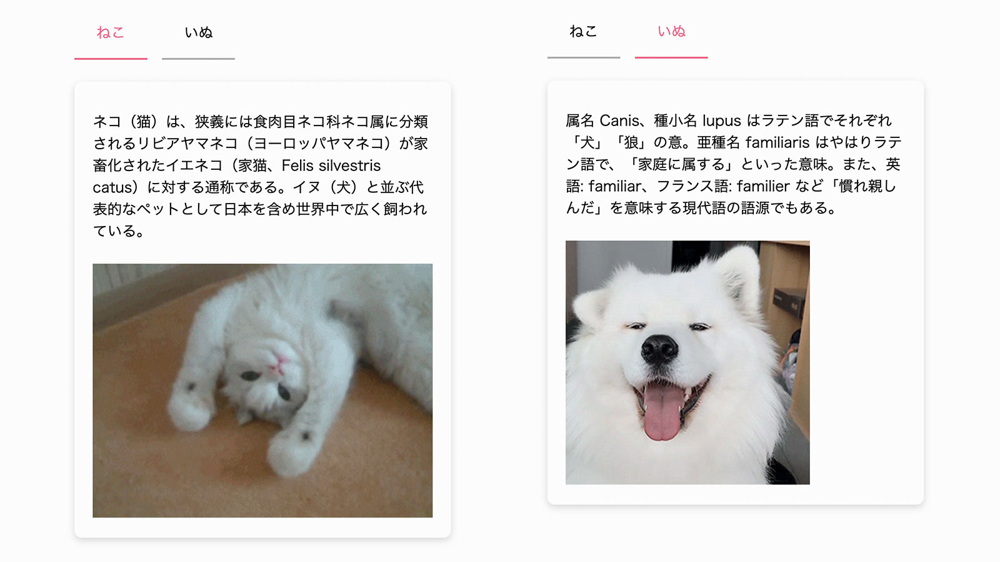

# タブ

## 問題

今回の問題ではタブを実装します。

[https://codepen.io/MasahiroHarada/pen/WNrXKdM/](https://codepen.io/MasahiroHarada/pen/WNrXKdM/)

後述する仕様の通りに動作するように JavaScript を編集しましょう。  
穴埋めになっているので `/* Insert code here... */` の箇所にコードを足してください。

HTML と CSS は出来ているので変更しません。  
ただし重要なヒントですのでよく確認してください。

## 前提条件

- jQuery などのライブラリは使用せずに実装してください。
- 対応ブラウザは Google Chrome 最新版とします。
- 解答例では ES2015 以降の文法も使用します。

## タブ機能の仕様

- 左：ねこが選ばれている状態
- 右：いぬが選ばれている状態

## 進め方

[モーダルウィンドウ](/practice/modal)と同様です。

## ヒント

- タブの選択状態は、どのように切り替えるか？CSS を探ってみよう。
- タブパネルの選択状態は、どのように切り替えるか？CSS を探ってみよう。
